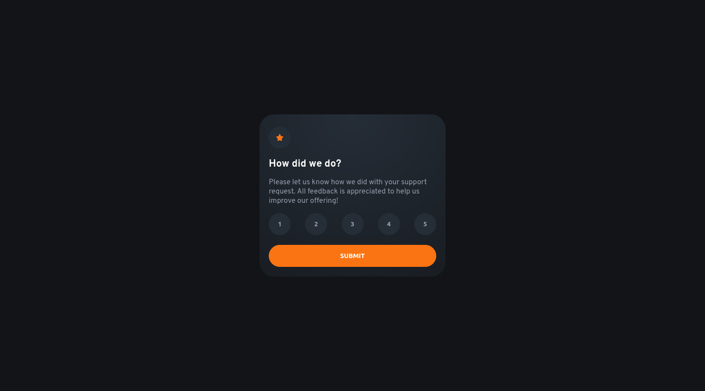
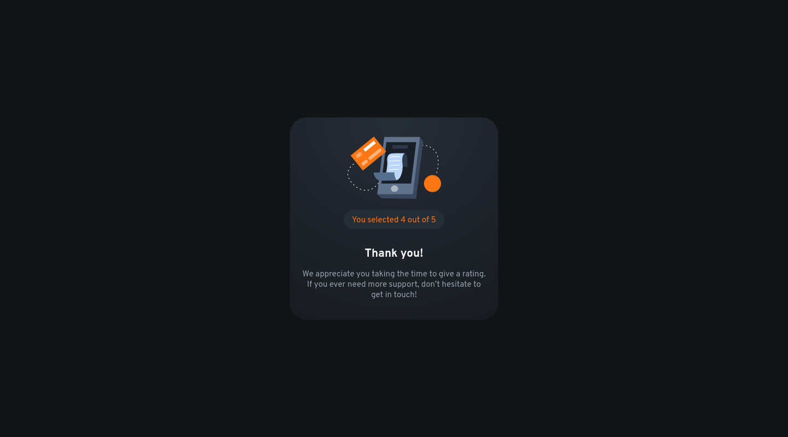

# Frontend Mentor - Interactive rating component solution

This is a solution to the [Interactive rating component challenge on Frontend Mentor](https://www.frontendmentor.io/challenges/interactive-rating-component-koxpeBUmI). Frontend Mentor challenges help you improve your coding skills by building realistic projects. 

## Table of contents

- [Overview](#overview)
  - [The challenge](#the-challenge)
  - [Screenshot](#screenshot)
  - [Links](#links)
- [My process](#my-process)
  - [Built with](#built-with)
  - [What I learned](#what-i-learned)
  - [Continued development](#continued-development)
- [Author](#author)

## Overview

### The challenge

Users should be able to:

- View the optimal layout for the app depending on their device's screen size
- See hover states for all interactive elements on the page
- Select and submit a number rating
- See the "Thank you" card state after submitting a rating

### Screenshot




### Links

- Solution URL: [https://github.com/HubertSzymanski5/frontend-mentor-interactive-rating-component](https://github.com/HubertSzymanski5/frontend-mentor-interactive-rating-component)
- Live Site URL: [TODO](TODO)

## My process

### Built with

- Semantic HTML5 markup
- CSS custom properties
- Flexbox

### What I learned

Huge fight when tried to use form instead of plain buttons. Way to go was with use of buttons and
scripting whole selection logic.

I learned that I can use data attributes to pass values to JS. `data-value` attribute can be read
with use of `dataset` in JS. I found it extremely useful to pass marks values.
```html
<button class="mark" data-value="1">1</button>
```
```js
const value = markBtn.dataset.value;
```

### Continued development

I want to add some animation to give this component some more life.

## Author

- Frontend Mentor - [@yourusername](https://www.frontendmentor.io/profile/yourusername)
